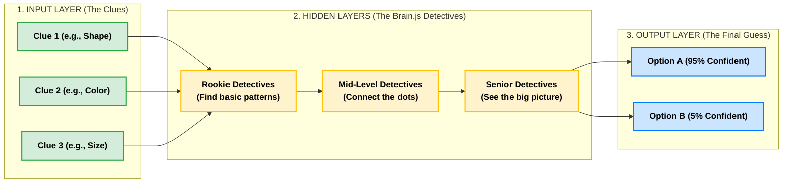

```mermaid
flowchart LR
%% Styling to keep it presentation-friendly
classDef input fill:#d4edda,stroke:#28a745,stroke-width:2px,color:black,font-weight:bold;
classDef hidden fill:#fff3cd,stroke:#ffc107,stroke-width:2px,color:black,font-weight:bold;
classDef output fill:#cce5ff,stroke:#007bff,stroke-width:2px,color:black,font-weight:bold;

subgraph Input ["1. INPUT LAYER (The Clues)"]
direction TB
I1["Clue 1 (e.g., Shape)"]
I2["Clue 2 (e.g., Color)"]
I3["Clue 3 (e.g., Size)"]
end

subgraph Hidden ["2. HIDDEN LAYERS (The Brain.js Detectives)"]
direction TB
H1["Rookie Detectives\n(Find basic patterns)"]
H2["Mid-Level Detectives\n(Connect the dots)"]
H3["Senior Detectives\n(See the big picture)"]
end

subgraph Output ["3. OUTPUT LAYER (The Final Guess)"]
direction TB
O1["Option A (95% Confident)"]
O2["Option B (5% Confident)"]
end

%% Drawing the arrows to show how information flows
I1 & I2 & I3 --> H1
H1 --> H2
H2 --> H3
H3 --> O1 & O2

%% Applying the colors
class I1,I2,I3 input;
class H1,H2,H3 hidden;
class O1,O2 output;
```