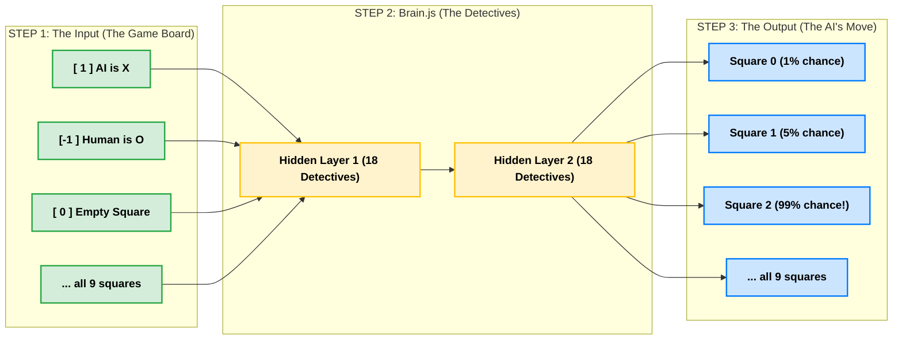

```mermaid
flowchart LR
%% Styling for presentation (Green = Input, Yellow = Brain, Blue = Output)
classDef input fill:#d4edda,stroke:#28a745,stroke-width:2px,color:black,font-weight:bold;
classDef hidden fill:#fff3cd,stroke:#ffc107,stroke-width:2px,color:black,font-weight:bold;
classDef output fill:#cce5ff,stroke:#007bff,stroke-width:2px,color:black,font-weight:bold;

subgraph Step1["STEP 1: The Input (The Game Board)"]
direction TB
I1["[ 1 ] AI is X"]
I2["[-1 ] Human is O"]
I3["[ 0 ] Empty Square"]
I4["... all 9 squares"]
end

subgraph Step2["STEP 2: Brain.js (The Detectives)"]
direction TB
L1["Hidden Layer 1 (18 Detectives)"]
L2["Hidden Layer 2 (18 Detectives)"]
end

subgraph Step3["STEP 3: The Output (The AI's Move)"]
direction TB
O1["Square 0 (1% chance)"]
O2["Square 1 (5% chance)"]
O3["Square 2 (99% chance!)"]
O4["... all 9 squares"]
end

%% Drawing the flow of information
I1 & I2 & I3 & I4 --> L1
L1 --> L2
L2 --> O1 & O2 & O3 & O4

%% Applying the colors
class I1,I2,I3,I4 input;
class L1,L2 hidden;
class O1,O2,O3,O4 output;
```